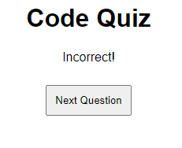

# Code-Quiz

## Quiz App

The Quiz Application is a web-based quiz platform designed to test users' knowledge on various topics. The application provides an interactive quiz-taking experience, complete with a timer, multiple-choice questions, and the ability to save and display high scores.

## Description

The Quiz App is a web application that allows users to take a quiz on various programming topics. The app presents a series of multiple-choice questions, tracks the time taken to complete the quiz, and allows users to save their high scores. The project is built using HTML, CSS, and JavaScript.

## Features

Multiple-choice questions on programming concepts.
Timer functionality to track the time taken to complete the quiz.
High score saving and display.
Responsive design for a seamless user experience on different devices.

## Screenshots

## Built With

HTML
CSS
JavaScript

## License

This project is licensed under the MIT License.